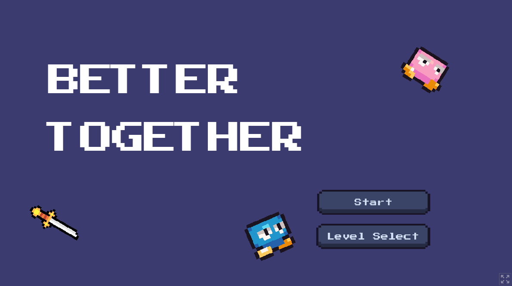
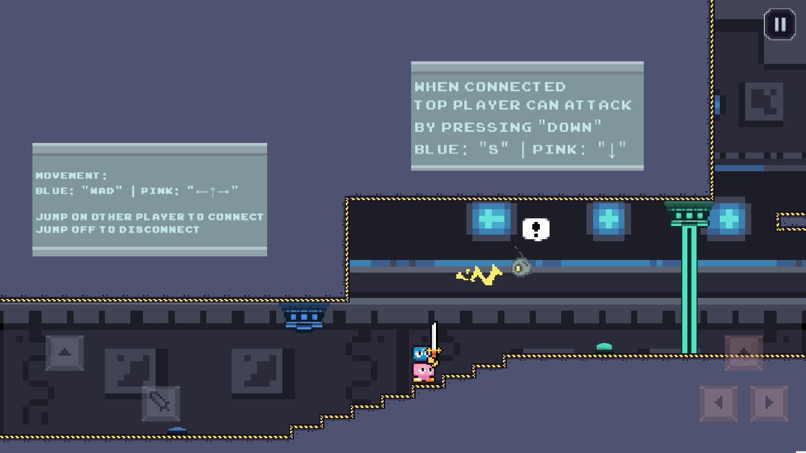
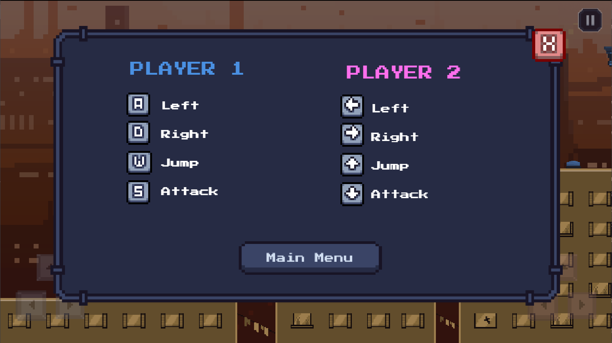
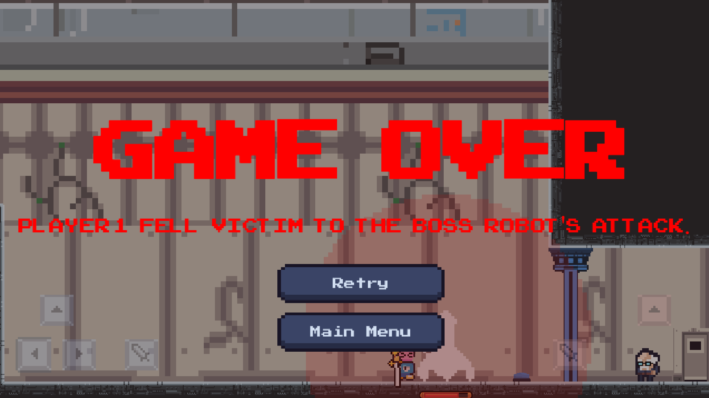

<h1 align="center">Better Together</h1>

> a local co-op platformer game created in 9 days for the GDevlop Game Jam #3
---
* Play the game on itch.io: https://aussar.itch.io/better-together

A local co-op platformer where two defective robots embark on a quest to find a scientist who can repair them. The robots, who narrowly escaped incineration, must work together by separating and connecting to navigate through a series of challenging levels filled with obstacles, traps and enemies.

Players can control the robot either using a single keyboard (WASD and Arrow Buttons) or using the on-screen touch controls or both. The game can be played alone, but as the game title suggests, it is better played together!

---

## 📸 Screenshots

> Level 1 Gameplay

> Pause Menu and Controls with Level 2

> Game Over Overlay with Level 3

---
# Development Setup
1. Clone (or Download the `.zip` of) the repository
2. Open GDevelop and navigate to Home > Build > Existing Projects > Open Existing Project
3. Select the `game.json` file in `src`
